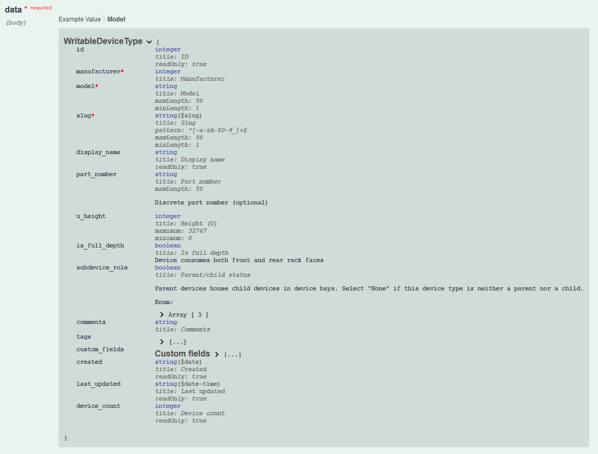

# Contributing

## Modules

The structure of the Netbox modules attempts to follow the layout of the Netbox API by having a module_util for each application (`dcim, ipam, tenancy, etc`) that inherits from a base module (`NetboxModule - netbox_utils.py`) and then implements the specific endpoints within the correct application module.

e.g. Add logic for adding devices under netbox_dcim.py or ip addresses under netbox_ipam.py

In turn when creating the actual modules, we're just calling a single function and passing in the Ansible Module and the endpoint. This means all the logic is within the specific application's module_util module and a lot of the logic should be the same for most endpoints since it is a basic operation of using the desired state of the endpoint and then either making sure it exists, updating it if it does exist, or removing it. There may be some special logic for other endpoints, but it should be minimal.

(Ansible Module) netbox_{{ endpoint }} -> (Module Util) netbox_{{ application }} -> (Module Util) netbox_utils

These modules are built using the pynetbox Python library which allows you to interact with Netbox using objects. Most of this is abstracted away when creating more modules, but something to be aware of. The reasoning for using underscores within the endpoint names is so the endpoints work with pynetbox.

An example of connecting to a Netbox instance and then choosing the application, endpoint, and operation:

```python
import pynetbox

nb = pynetbox.api("http://localhost:32768", "0123456789abcdef0123456789abcdef01234567")

# applications
nb.circuits
nb.dcim
nb.extras
nb.ipam
nb.secrets
nb.tenancy
nb.virtualization

# endpoints (small sample)
nb.circuits.providers
nb.dcim.devices
nb.dcim.device_types
nb.ipam.vrfs
nb.ipam.ip_addresses
nb.tenancy.tenant_groups

# operations
## Grabs a list of all endpoints
nb.dcim.devices.**all**
## Can pass a list of dicts to create multiple of the endpoints or just a dict to create a single endpoint
nb.dcim.devices.**create**
## Can filter to grab a name of the endpoint being filtered, not an object (Uses the same search criteria as the API)
nb.dcim.devices.**filter**
e.g. nb.dcim.devices.filter(name="test")
## Will retrieve the actual object that can be manipulated (updated, etc.) (Uses the same search criteria as the API)
nb.dcim.devices.**get**
e.g. nb.dcim.devices.get(name="test")

# Manipulate object after using .get
## Now you can manipulate the object the same as a Python object
device = nb.dcim.devices.get(name="test")
device.description = "Test Description"
## Patch operation (patches the data to the API)
device.save()

## If you were to just update the data in a fell swoop
serial = {"serial": "FXS10001", "description": "Test Description"}
## this operation will update the device and use the .save() method behind the scenes
device.update(serial)
```

## Adding an Endpoint

### Updating Variables within Module Utils

First thing is to setup several variables within **netbox_utils** and **netbox_application** module utils:

Check the following variable to make sure the endpoint is within the correct application within **netbox_utils**:

```python
API_APPS_ENDPOINTS = dict(
    circuits=[],
    dcim=[
        "devices",
        "device_roles",
        "device_types",
        "interfaces",
        "manufacturers",
        "platforms",
        "racks",
        "rack_groups",
        "rack_roles",
        "regions",
        "sites",
    ],
    extras=[],
    ipam=["ip_addresses", "prefixes", "roles", "vlans", "vlan_groups", "vrfs"],
    secrets=[],
    tenancy=["tenants", "tenant_groups"],
    virtualization=["clusters"],
)
```

Create a new variable in the **netbox_application** module until that matches the endpoint with any spaces being converted to underscores and all lowercase:

```python
NB_DEVICE_TYPES = "device_types"
```

Add the endpoint to the **run** method of supported endpoints:

```python
class NetboxDcimModule(NetboxModule):
    def __init__(self, module, endpoint):
        super().__init__(module, endpoint)

    def run(self):
        """
        This function should have all necessary code for endpoints within the application
        to create/update/delete the endpoint objects
        Supported endpoints:
        - device_types
```

Add the endpoint to the **ENDPOINT_NAME_MAPPING** variable within the **netbox_utils** module util.

```python
ENDPOINT_NAME_MAPPING = {
    "device_types": "device_type",
}
```

Log into your Netbox instance and navigate to `/api/docs` and searching for the **POST** documents for the given endpoint you're looking to create.

The module should implement all available fields that are not the **id** or **readOnly** such as the **created, last_updated, device_count** in the example above.

Add the endpoint to the **ALLOWED_QUERY_PARAMS** variable within the **netbox_utils** module util. This should be something unique for the endpoint and will be used within the **_build_query_params** method to dynamically build query params.

```python
ALLOWED_QUERY_PARAMS = {
    "device_type": set(["slug"]),
}
```

If the endpoint has a key that uses an **Array**, you will need to add the endpoint to **REQUIRED_ID_FIND** and the key that will need to be converted. The lookup is done from the endpoint and pulls the choices from the API.

```python
REQUIRED_ID_FIND = {
    "circuits": set(["status"]),
    "devices": set(["status", "face"]),
    "device_types": set(["subdevice_role"]),
    "interfaces": set(["form_factor", "mode"]),
    "ip_addresses": set(["status", "role"]),
    "prefixes": set(["status"]),
    "racks": set(["status", "outer_unit", "type"]),
    "services": set(["protocol"]),
    "sites": set(["status"]),
    "virtual_machines": set(["status", "face"]),
    "vlans": set(["status"]),
}
# This is the method that uses the REQUIRED_ID_FIND variable (no change should be required within the method)
    def _fetch_choice_value(self, search, endpoint):
        app = self._find_app(endpoint)
        nb_app = getattr(self.nb, app)
        nb_endpoint = getattr(nb_app, endpoint)
        endpoint_choices = nb_endpoint.choices()

        choices = [x for x in chain.from_iterable(endpoint_choices.values())]

        for item in choices:
            if item["display_name"].lower() == search.lower():
                return item["value"]
            elif item["value"] == search.lower():
                return item["value"]
        self._handle_errors(
            msg="%s was not found as a valid choice for %s" % (search, endpoint)
        )

    def _change_choices_id(self, endpoint, data):
        """Used to change data that is static and under _choices for the application.
        ex. DEVICE_STATUS
        :returns data (dict): Returns the user defined data back with updated fields for _choices
        :params endpoint (str): The endpoint that will be used for mapping to required _choices
        :params data (dict): User defined data passed into the module
        """
        if REQUIRED_ID_FIND.get(endpoint):
            required_choices = REQUIRED_ID_FIND[endpoint]
            for choice in required_choices:
                if data.get(choice):
                    if isinstance(data[choice], int):
                        continue
                    choice_value = self._fetch_choice_value(data[choice], endpoint)
                    data[choice] = choice_value

        return data
```

If the key is something that pertains to a different endpoint such as **manufacturer** it will need to be added to a few variables within **netbox_utils**.

```python
CONVERT_TO_ID = dict(
    manufacturer="manufacturers",
)
QUERY_TYPES = dict(
    manufacturer="slug",
)
```

If **slug** and **name** is required, we should leave **slug** out as an option within the module docs and generate it dynamically. Add the endpoint to **SLUG_REQUIRED** within **netbox_utils** module util.

```python
SLUG_REQUIRED = {
    "device_roles",
    "ipam_roles",
    "rack_groups",
    "rack_roles",
    "roles",
    "manufacturers",
    "platforms",
    "vlan_groups",
}
```

Add code to the **netbox_application** module util to convert name to **slug**"

```python
if self.endpoint in SLUG_REQUIRED:
    if not data.get("slug"):
        data["slug"] = self._to_slug(name)
```

If either **role** or **group** are within the acceptable keys to POST to the endpoint, we should prefix it with the endpoint name. This is to prevent the code from trying to fetch an ID from the wrong endpoint.
Add the new key to **CONVERT_KEYS** within **netbox_utils** module util.

```python
CONVERT_KEYS = {
    "prefix_role": "role",
    "rack_group": "group",
    "rack_role": "role",
    "tenant_group": "group",
    "vlan_role": "role",
    "vlan_group": "group",
}

# Adding the method that uses this code (no change should be required within the method)
def _convert_identical_keys(self, data):
    """
    Used to change non-clashing keys for each module into identical keys that are required
    to be passed to pynetbox
    ex. rack_role back into role to pass to Netbox
    Returns data
    :params data (dict): Data dictionary after _find_ids method ran
    """
    for key in data:
        if key in CONVERT_KEYS:
            new_key = CONVERT_KEYS[key]
            value = data.pop(key)
            data[new_key] = value

    return data
```

#### Creating **netbox_endpoint** Module

Copying an existing module that has close to the same options is typically the path to least resistence and then updating portions of it to fit the new module.

- Change the author: `Copyright: (c) 2018, Mikhail Yohman (@FragmentedPacket) <mikhail.yohman@gmail.com>`
- Update the **DOCUMENTATION**/**EXAMPLES**/**RETURN** string with the necessary information
  - Main things are module, descriptions, author, version and the sub options under data
  - The **RETURN** should return the singular of the endpoint name (done dynamically, but needs to be documented correctly)
- Update the module_util, module, and endpoint variable for the endpoint

  ```python
  from ansible_collections.netbox.netbox.plugins.module_utils.netbox_dcim import (
      NetboxDcimModule,
      NB_DEVICE_ROLES,
  )
  ```

- Update the **main()** as necessary:

  ```python
  # Add if name is required or change to match required fields
  if not module.params["data"].get("name"):
      module.fail_json(msg="missing name")
  # Make sure the objects are endpoint name and the correct class and variable are being called for the endpoint
  netbox_device_role = NetboxDcimModule(module, NB_DEVICE_ROLES)
  netbox_device_role.run()
  ```

#### Testing

- Please update any associated data within the `tests/unit/module_utils/test_data/` folders for the specified tests. This will most likely be needed as there are a few unit tests that test the data of **ALLOWED_QUERY_PARAMS**, etc.

  ```python
  def test_normalize_data_returns_correct_data()
  def test_find_app_returns_valid_app()
  def test_change_choices_id()
  def test_build_query_params_no_child()
  def test_build_query_params_child()
  ```

- Check each test above to see which `test_data` it uses and edit the corresponding data.json file
- Please add or update an existing play to test the new Netbox module for integration testing within `tests/integration/integration-tests.yml`. Make sure to test creation, duplicate, update (if possible), and deletion along with any other conditions that may want to be tested.
- Run `pytest -vv` to make sure all unit tests pass
- Run `black .` within the base directory for black formatting as it's required for tests to pass
- Run `ansible-lint integration-tests.yml` it's required for tests to pass
- Check necessary dependencies defined within `.travis.yml` for now if you're wanting to test locally


## Inventory

Integration tests are run by comparing `ansible-inventory --list` against known output, for a few different inventory files with different options.

When the inventory plugin is updated in a way that changes this output (or `netbox-deploy.py` is changed), the test data used for comparison will need to be updated. There is a script `./hacking/update_test_inventories.sh` to do this.

Run from the root project working directory, and make sure you have a clean test instance of Netbox set up with test data loaded into it from `./tests/integration/netbox-deploy.py`

```
./hacking/update_test_inventories.sh
```

After running the script, to prevent introducing a regression you'll need to manually read through the diff to verify it looks correct.


# Setting up a local dev/test environment

You can see the specific details of what happens in CI in  `.travis.yml`. An overview of what you need to do is:

* Run a test instance of Netbox on port 32768. The `netbox-docker` project makes this easy.

```
git clone git@github.com:netbox-community/netbox-docker.git
cd netbox-docker
export VERSION=snapshot
docker-compose pull
docker-compose up -d
```

* Check out this repo to a directory named `netbox` in a directory tree `ansible_collections/netbox/netbox` - running some `ansible-test` commands will complain if there's no `ansible_collections` in the current directory path, so you'd have to build/install the collection every time you want to run tests.

```
git clone git@github.com:netbox-community/ansible_modules.git ansible_collections/netbox/netbox
```

* Recommended - set up a Python virtualenv, in a directory above the collection. If you create a virtualenv inside the `ansible_modules` working directory `ansible-galaxy collection build` will include it as part of the build (until Ansible 2.10 where `build_ignore` is supported)

```
cd ../../..
python3 -m venv venv
source venv/bin/activate
cd ansible_collections/netbox/netbox
```

* Install required python packages - see `.travis.yml` for the latest `pip install` list in different environments.
