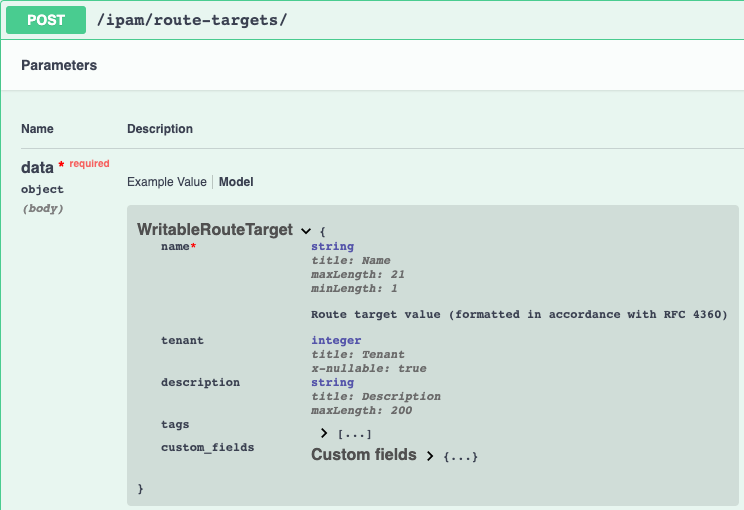

==========================
Contributing a New Module
==========================

We'll go through the build a module for NetBox's new **route-targets** endpoint under the **IPAM** app.

Research API Spec to find necessary module arguments
-------------------------------------------------------

We'll need to look at the API spec for **route-target** to understand what arguments we need to support in our module.

This module is light, but we can will cover most of the changes required for any module to function properly. We can see that the only required argument is going to be **name**. The next
argument will be **tenant** that which is another object within NetBox, but fortunately we have already implemented the necessary changes to find a **tenant**. **Description** is only text field
so there won't be any changes necessary for this argument. **Tags** is handled the same way as **tenant** and no additional code will be required for that. **Custom fields** is similar, but doesn't
require any necessary search for an object, but the custom field must exist on the endpoint.

- **name** (Required)
- **tenant** (Optional)
- **description** (Optional)
- **tags** (Optional)
- **custom_fields** (Optional)

Update App Module Util
----------------------------------

Open ``plugins/module_utils/netbox_ipam.py`` file and update the following.

.. code-block:: python

  ...
  NB_ROUTE_TARGETS = "route_targets"
  ...
  
  class NetboxIpamModule(NetboxModule):
      ...
      def run(self):
      """
      ...
      - route_targets
      ...
      """

These should be all the changes we need within this file for the time being.

Update Netbox Utils
-------------------------------

Open ``plugins/module_utils/netbox_utils.py`` and update the following.

.. code-block:: python

  # Used to map endpoints to applications dynamically
  API_APPS_ENDPOINTS = dict(
      ...
      extras=["tags"],
      ipam=[
          ...
          "route_targets",
          ...
      ],
      ...

.. code-block:: python

  # Used to normalize data for the respective query types used to find endpoints
  QUERY_TYPES = dict(
      ...
      region="slug",
      rir="slug",
      route_targets="name",
      ...

.. code-block:: python

  ENDPOINT_NAME_MAPPING = {
      ...
      "regions": "region",
      "rirs": "rir",
      "roles": "role",
      "route_targets": "route_target",
      ...

.. code-block:: python

  ALLOWED_QUERY_PARAMS = {
      ...
      "region": set(["slug"]),
      "rear_port": set(["name", "device"]),
      "rear_port_template": set(["name", "device_type"]),
      "rir": set(["slug"]),
      "role": set(["slug"]),
      "route_target": set(["name"]),
      ...

It is almost the same as the ``QUERY_TYPE``, but this is used to build the query params for an object and can be overridden.

Create the Module Python File
----------------------------------

Copy an existing module file from ``plugins/modules`` and name it ``versa_route_target.py``.

Now we need to update the ``DOCUMENTATION`` variable to match the module we're creating.

.. note::
  There are builtin options that you shouldn't have to change such as ``netbox_url``, ``netbox_token``, ``state``,
  ``query_params``, and ``validate_certs``.

.. code-block:: python

  DOCUMENTATION = r"""
  ---
  module: netbox_route_target
  short_description: Creates or removes route targets from Netbox
  description:
    - Creates or removes route targets from Netbox
  notes:
    - Tags should be defined as a YAML list
    - This should be ran with connection C(local) and hosts C(localhost)
  author:
    - Mikhail Yohman (@fragmentedpacket)
  requirements:
    - pynetbox
  version_added: "2.0.0"
  options:
    ...
    data:
      type: dict
      description:
        - Defines the route target configuration
      suboptions:
        name:
          description:
            - Route target name
          required: true
          type: str
        tenant:
          description:
            - The tenant that the route target will be assigned to
          required: false
          type: raw
        description:
          description:
            - Tag description
          required: false
          type: str
        tags:
          description:
            - Any tags that the device may need to be associated with
          required: false
          type: list
          elements: raw
        custom_fields:
          description:
            - must exist in Netbox
          required: false
          type: dict
      required: true
    ...
  """

Update the following:
  - module
  - short_description
  - description
  - author
  - version_added (update to next minor number from what is on Ansible Galaxy)
  - options -> data (All the necessary information from what we found from the API docs)

Just a few things to note here are the types that are defined for the documentation. The should mostly follow the API such as a string, integer, list, etc.
In the case of arguments that resolve to objects within NetBox, typically **raw** is used so the user can specify either a string or a dictionary with other
fields that will help search for the object within the API.

The next step is to update the ``EXAMPLES`` variable.

.. code-block:: python

  EXAMPLES = r"""
  - name: "Test route target creation/deletion"
    connection: local
    hosts: localhost
    gather_facts: False
    tasks:
      - name: Create Route Targets
        netbox.netbox.netbox_route_target:
          netbox_url: http://netbox.local
          netbox_token: thisIsMyToken
          data:
            name: "{{ item.name }}"
            tenant: "Test Tenant"
            tags:
              - Schnozzberry
        loop:
          - { name: "65000:65001", description: "management" }
          - { name: "65000:65002", description: "tunnel" }
  
      - name: Update Description on Route Targets
        netbox.netbox.netbox_route_target:
          netbox_url: http://netbox.local
          netbox_token: thisIsMyToken
          data:
            name: "{{ item.name }}"
            tenant: "Test Tenant"
            description: "{{ item.description }}"
            tags:
              - Schnozzberry
        loop:
          - { name: "65000:65001", description: "management" }
          - { name: "65000:65002", description: "tunnel" }
  
      - name: Delete Route Targets
        netbox.netbox.netbox_route_target:
          netbox_url: http://netbox.local
          netbox_token: thisIsMyToken
          data:
            name: "{{ item }}"
          state: absent
        loop:
          - "65000:65001"
          - "65000:65002"
  """

The examples should encompass as many different use cases of the module as possible to aid the user with how they can use the module.

The only update to the ``RETURN`` variable should be the name of the object returned.

.. code-block:: python

    RETURN = r"""
    route_targets:
      description: Serialized object as created/existent/updated/deleted within Netbox
      returned: always
      type: dict
    msg:
      description: Message indicating failure or info about what has been achieved
      returned: always
      type: str
    """

Now we import the necessary components from the collection that make up the meat of our module.

.. code-block:: python

  from ansible_collections.netbox.netbox.plugins.module_utils.netbox_utils import (
      NetboxAnsibleModule,
      NETBOX_ARG_SPEC,
  )
  from ansible_collections.netbox.netbox.plugins.module_utils.netbox_ipam import (
      NetboxIpamModule,
      NB_ROUTE_TARGETS,
  )
  from copy import deepcopy

We import our custom ``NetboxAnsibleModule`` to properly validate our data and our base argument spec (``NETBOX_ARG_SPEC``) that all modules should implement.

.. code-block:: python

  NETBOX_ARG_SPEC = dict(
      netbox_url=dict(type="str", required=True),
      netbox_token=dict(type="str", required=True, no_log=True),
      state=dict(required=False, default="present", choices=["present", "absent"]),
      query_params=dict(required=False, type="list", elements="str"),
      validate_certs=dict(type="raw", default=True),
  )

Let's move onto the ``main()`` function in the module and take a look at the required argument spec.

.. code-block:: python

  def main():
      """
      Main entry point for module execution
      """
      argument_spec = deepcopy(NETBOX_ARG_SPEC)
      argument_spec.update(
          dict(
              data=dict(
                  type="dict",
                  required=True,
                  options=dict(
                      name=dict(required=True, type="str"),
                      tenant=dict(required=False, type="raw"),
                      description=dict(required=False, type="str"),
                      tags=dict(required=False, type="list", elements="raw"),
                      custom_fields=dict(required=False, type="dict"),
                  ),
              ),
          )
      )

We augment the argument spec by adding the module specific argument spec we need. You may notice that this matches the documentation due to
the sanity tests that will run when a PR is submitted to the project and both the documentation and argument spec should match.

.. code-block:: python

  def main():
      ...
      module = NetboxAnsibleModule(argument_spec=argument_spec, supports_check_mode=True)

      netbox_route_target = NetboxIpamModule(module, NB_ROUTE_TARGETS)
      netbox_route_target.run()

We then initialize our custom ``NetboxAnsibleModule`` that will be passed into our custom ``NetboxIpamModule`` and then execute the ``run`` method.
That is all that our module needs to implement at this point. We can test this locally by installing the collection locally and testing this within a playbook by following the directions :ref:`here<Build From Source>`.

Here is the output of the a playbook I created using the examples we documented with the only changes being the ``netbox_url`` and ``netbox_token``.

.. code-block:: bash

  ❯ ansible-playbook pb.test-rt.yml -vv
  ansible-playbook 2.10.4
    config file = /Users/myohman/cloned-repos/ansible_modules/ansible.cfg
    configured module search path = ['/Users/myohman/.ansible/plugins/modules', '/usr/share/ansible/plugins/modules']
    ansible python module location = /Users/myohman/.virtualenvs/main3.8/lib/python3.8/site-packages/ansible
    executable location = /Users/myohman/.virtualenvs/main3.8/bin/ansible-playbook
    python version = 3.8.6 (default, Nov 17 2020, 18:43:06) [Clang 12.0.0 (clang-1200.0.32.27)]
  Using /Users/myohman/cloned-repos/ansible_modules/ansible.cfg as config file
  [WARNING]: No inventory was parsed, only implicit localhost is available
  [WARNING]: provided hosts list is empty, only localhost is available. Note that the implicit localhost does not match 'all'
  Skipping callback 'default', as we already have a stdout callback.
  Skipping callback 'minimal', as we already have a stdout callback.
  Skipping callback 'oneline', as we already have a stdout callback.
  
  PLAYBOOK: pb.test-rt.yml *********************************************************************************************************************************************************************************************************************************************************************************************
  1 plays in pb.test-rt.yml
  
  PLAY [Test route target creation/deletion] ***************************************************************************************************************************************************************************************************************************************************************************
  META: ran handlers
  
  TASK [Create Route Targets] ******************************************************************************************************************************************************************************************************************************************************************************************
  task path: /Users/myohman/cloned-repos/ansible_modules/pb.test-rt.yml:7
  changed: [localhost] => (item={'name': '65000:65001', 'description': 'management'}) => {"ansible_loop_var": "item", "changed": true, "item": {"description": "management", "name": "65000:65001"}, "msg": "route_target 65000:65001 updated", "route_target": {"created": "2021-01-13", "custom_fields": {}, "description": "", "id": 1, "last_updated": "2021-01-13T23:06:40.211082Z", "name": "65000:65001", "tags": [4], "tenant": 1, "url": "http://192.168.50.10:8000/api/ipam/route-targets/1/"}}
  changed: [localhost] => (item={'name': '65000:65002', 'description': 'tunnel'}) => {"ansible_loop_var": "item", "changed": true, "item": {"description": "tunnel", "name": "65000:65002"}, "msg": "route_target 65000:65002 created", "route_target": {"created": "2021-01-13", "custom_fields": {}, "description": "", "id": 2, "last_updated": "2021-01-13T23:59:29.946943Z", "name": "65000:65002", "tags": [4], "tenant": 1, "url": "http://192.168.50.10:8000/api/ipam/route-targets/2/"}}
  
  TASK [Update Description on Route Targets] ***************************************************************************************************************************************************************************************************************************************************************************
  task path: /Users/myohman/cloned-repos/ansible_modules/pb.test-rt.yml:20
  changed: [localhost] => (item={'name': '65000:65001', 'description': 'management'}) => {"ansible_loop_var": "item", "changed": true, "item": {"description": "management", "name": "65000:65001"}, "msg": "route_target 65000:65001 updated", "route_target": {"created": "2021-01-13", "custom_fields": {}, "description": "management", "id": 1, "last_updated": "2021-01-13T23:59:29.146435Z", "name": "65000:65001", "tags": [4], "tenant": 1, "url": "http://192.168.50.10:8000/api/ipam/route-targets/1/"}}
  changed: [localhost] => (item={'name': '65000:65002', 'description': 'tunnel'}) => {"ansible_loop_var": "item", "changed": true, "item": {"description": "tunnel", "name": "65000:65002"}, "msg": "route_target 65000:65002 updated", "route_target": {"created": "2021-01-13", "custom_fields": {}, "description": "tunnel", "id": 2, "last_updated": "2021-01-13T23:59:29.946943Z", "name": "65000:65002", "tags": [4], "tenant": 1, "url": "http://192.168.50.10:8000/api/ipam/route-targets/2/"}}
  
  TASK [Delete Route Targets] ******************************************************************************************************************************************************************************************************************************************************************************************
  task path: /Users/myohman/cloned-repos/ansible_modules/pb.test-rt.yml:34
  changed: [localhost] => (item=65000:65001) => {"ansible_loop_var": "item", "changed": true, "item": "65000:65001", "msg": "route_target 65000:65001 deleted", "route_target": {"created": "2021-01-13", "custom_fields": {}, "description": "management", "id": 1, "last_updated": "2021-01-13T23:59:30.829004Z", "name": "65000:65001", "tags": [4], "tenant": 1, "url": "http://192.168.50.10:8000/api/ipam/route-targets/1/"}}
  changed: [localhost] => (item=65000:65002) => {"ansible_loop_var": "item", "changed": true, "item": "65000:65002", "msg": "route_target 65000:65002 deleted", "route_target": {"created": "2021-01-13", "custom_fields": {}, "description": "tunnel", "id": 2, "last_updated": "2021-01-13T23:59:31.748181Z", "name": "65000:65002", "tags": [4], "tenant": 1, "url": "http://192.168.50.10:8000/api/ipam/route-targets/2/"}}
  META: ran handlers
  META: ran handlers
  
  PLAY RECAP ***********************************************************************************************************************************************************************************************************************************************************************************************************
  localhost                  : ok=3    changed=3    unreachable=0    failed=0    skipped=0    rescued=0    ignored=0

Testing
-----------------

Sanity Tests
+++++++++++++++++++++

Sanity tests are ran and involve multiple tests that Ansible deems necessary. We adhere to these to make sure we're following Ansible's guidelines.

There are a few tests we may need to skip depending on the module and these can be found within ``tests/sanity/ignore-2.10.txt``. If your module fails sanity tests, you may add an exception to this file
if it is one of the skipped tests already documented in there for existing modules. If it is not, then please raise the error in the PR you open for your module contribution.

Integration Tests
++++++++++++++++++++++

Now we need to make sure we add integration tests to test our newly created module. Let's take a high level look at how the integration tests work.

They're stored in ``tests/integration/targets`` and each target corresponds with a command line argument you specify when running ``ansible-test integration`` to tell it which target to execute.

.. code-block:: bash

  ❯ tree tests/integration
  tests/integration
  ├── integration.cfg
  ├── netbox-deploy.py
  ├── render_config.sh
  └── targets
      ├── latest
      │   └── tasks
      │       ├── main.yml
      │       ├── netbox_aggregate.yml
      │       ├── netbox_cable.yml
      ├── regression-latest
      │   └── tasks
      │       └── main.yml
      ├── regression-v2.9
      │   └── tasks
      │       └── main.yml
      └── v2.9
          └── tasks
              ├── main.yml
              ├── netbox_aggregate.yml
              ├── netbox_cable.yml

This isn't all the directories or files, but since we only support the two latest NetBox releases, we have a folder for the  **latest** and the second latest version of NetBox, in this case v2.9.
We also have a **regression** targets for tests that cover found bugs. With the ``netbox_route_target`` module, since it's a **2.10** feature, we only have to worry about adding integration tests to the
**latest** target folder.

.. note:: If functionality exists in both supported versions, you can complete the steps below and then just copy over the tasks file we create below.

The way ``ansible-test`` works for integration tests is similar to roles where it will execute tasks from the ``main.yml`` file. The way we use the ``main.yml`` file here is by specifying a task for each module
that uses the ``include_tasks`` functionality to then test each module.

Let's start by adding to ``tests/integration/targets/latest/main.yml``.

.. code-block:: yaml

  ---
  ...
  - name: "NETBOX_ROUTE_TARGET_TESTS"
    include_tasks: "netbox_route_target.yml"

Next we'll create a new file named ``tests/integration/targets/latest/netbox_route_target.yml`` that will include our integration tests. Below is the pattern we'll follow.

- **Add** (check mode)
- **Add**
- **Add** (idempotent check)
- **Update** (check mode)
- **Update**
- **Update** (idempotent check)
- **Delete** (check mode)
- **Delete**
- **Delete** (idempotent)

I won't be posting the actual implementation of this as it is a few hundred lines long, but you can view it by browsing to the specific file. To run the integration tests, it is best to push your changes up
and let CI/CD pipeline to run, but we will be updating the development to allow local testing.

After all tests pass, let's generate our new documents. From the root of the collection, run the following commands.

.. code-block:: bash

  ❯ poetry shell && poetry install
  ❯ ./hacking/make-docs.sh
  rm: tests/output: No such file or directory
  rm: .pytest_cache: No such file or directory
  Using /Users/myohman/cloned-repos/ansible_modules/ansible.cfg as config file
  Created collection for netbox.netbox at /Users/myohman/cloned-repos/ansible_modules/netbox-netbox-2.0.0.tar.gz
  Starting galaxy collection install process
  [WARNING]: The specified collections path '/Users/myohman/cloned-repos/ansible_modules' is not part of the configured Ansible collections paths
  '/Users/myohman/.ansible/collections:/usr/share/ansible/collections'. The installed collection won't be picked up in an Ansible run.
  Process install dependency map
  Starting collection install process
  Installing 'netbox.netbox:2.0.0' to '/Users/myohman/cloned-repos/ansible_modules/ansible_collections/netbox/netbox'
  netbox.netbox (2.0.0) was installed successfully
  Installing 'ansible.netcommon:1.4.1' to '/Users/myohman/cloned-repos/ansible_modules/ansible_collections/ansible/netcommon'
  Downloading https://galaxy.ansible.com/download/ansible-netcommon-1.4.1.tar.gz to /Users/myohman/.ansible/tmp/ansible-local-4390k59zwzli/tmp5871aum5
  ansible.netcommon (1.4.1) was installed successfully
  Installing 'community.general:1.3.4' to '/Users/myohman/cloned-repos/ansible_modules/ansible_collections/community/general'
  Downloading https://galaxy.ansible.com/download/community-general-1.3.4.tar.gz to /Users/myohman/.ansible/tmp/ansible-local-4390k59zwzli/tmp5871aum5
  community.general (1.3.4) was installed successfully
  Installing 'google.cloud:1.0.1' to '/Users/myohman/cloned-repos/ansible_modules/ansible_collections/google/cloud'
  Downloading https://galaxy.ansible.com/download/google-cloud-1.0.1.tar.gz to /Users/myohman/.ansible/tmp/ansible-local-4390k59zwzli/tmp5871aum5
  google.cloud (1.0.1) was installed successfully
  Installing 'community.kubernetes:1.1.1' to '/Users/myohman/cloned-repos/ansible_modules/ansible_collections/community/kubernetes'
  Downloading https://galaxy.ansible.com/download/community-kubernetes-1.1.1.tar.gz to /Users/myohman/.ansible/tmp/ansible-local-4390k59zwzli/tmp5871aum5
  community.kubernetes (1.1.1) was installed successfully
  ERROR:antsibull:error=Cannot find plugin:func=get_ansible_plugin_info:mod=antsibull.docs_parsing.ansible_internal:plugin_name=netbox.netbox.netbox_interface:plugin_type=module|Error while extracting documentation. Will not document this plugin.

Let's move onto updating ``netbox_vrf`` module. This new model within NetBox is also tied to VRFs as ``import_targets`` and ``export_targets``. Here is a screenshot of the new options we will need to add to the :ref:`netbox_vrf module<ansible_collections.netbox.netbox.netbox_vrf>`.

.. image:: ./media/vrf_options.png

Let's move onto :ref:`Updating an Existing Module`.