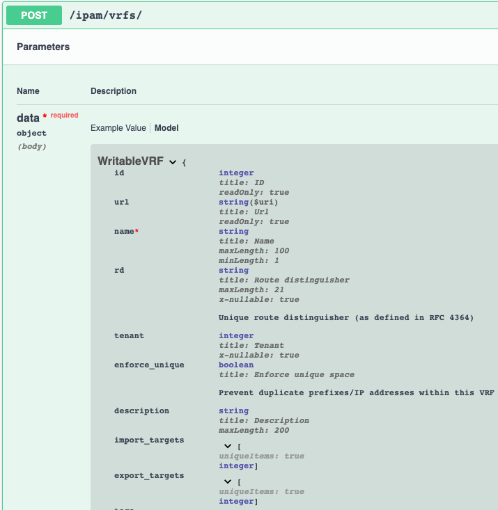

=================================
Updating an Existing Module
=================================

The main reason for updating an existing module is to either deprecate an option or add new options. We'll discuss the different methods for these options.

New Option - Doesn't correlate to different NetBox models
--------------------------------------------------------------

There are times when you need to add a new option to a module that doesn't require resolving to other models within NetBox. An example is adding a new interface type to ``netbox_device_interface`` module and only requires a documentation and argument spec update.

Another example is adding a ``dns_name`` field that is just a text field. The only updates that need to be made are to the ``DOCUMENTATION``, ``EXAMPLES`` and ``argument_spec`` within the module.

Steps:
- Update module ``DOCUMENTATION`` string with new option and type
- Update module ``EXAMPLES`` to include the new option
- Update module ``argument_spec`` to include new option and type
- Update integration tests to have the new option within tests

New Option - Must be resolved to a different model
--------------------------------------------------------------

When we add a new option that may point to a different model then we must make a few additional changes to both the module and the ``netbox_utils``. Let's stick with our previous example in :ref:`Contributing a New Module` for **route-targets**.
It turns out that this was implemented as a separate model, but has a relationship to VRFs to track both **import** and **export** targets. This means we will need to add those additional options to :ref:`netbox_vrf module<ansible_collections.netbox.netbox.netbox_vrf_module>`.

Here is a refresher for what we're looking to implement.

Let's start by updating :ref:`netbox_vrf<ansible_collections.netbox.netbox.netbox_vrf_module>` to specify both **import_targets** and **export_targets** as **lists** of **strings**.

We'll update the ``DOCUMENTATION`` first.

.. code-block:: yaml

  ...
  import_targets:
    description:
      - Import targets tied to VRF
    required: false
    type: list
    elements: str
    version_added: 2.0.0
  export_targets:
    description:
      - Export targets tied to VRF
    required: false
    type: list
    elements: str
    version_added: 2.0.0
  ...

Now that the ``DOCUMENTATION`` is updated, let's move onto updating the ``EXAMPLES``.

.. code-block:: yaml

    - name: Create vrf with all information
      netbox_vrf:
        netbox_url: http://netbox.local
        netbox_token: thisIsMyToken
        data:
          name: Test VRF
          rd: "65000:1"
          tenant: Test Tenant
          enforce_unique: true
          import_targets:
            - "65000:65001"
          export_targets:
            - "65000:65001"
          description: VRF description
          tags:
            - Schnozzberry
        state: present

The final update we have to make to the module is updating the ``argument_spec``.

.. code-block:: python

  def main():
      ...
      argument_spec.update(
          dict(
              data=dict(
                  type="dict",
                  required=True,
                  options=dict(
                      ...
                      import_targets=dict(required=False, type="list", elements="str"),
                      export_targets=dict(required=False, type="list", elements="str"),
                      ...
      ...

Now that we have that taken care of, let's move onto the ``netbox_utils``.

.. code-block:: python

  # Used to normalize data for the respective query types used to find endpoints
  QUERY_TYPES = dict(
      ...
      export_targets="name",
      group="slug",
      installed_device="name",
      import_targets="name",
      ...
  ...
  # Specifies keys within data that need to be converted to ID and the endpoint to be used when queried
  CONVERT_TO_ID = {
      ...
      "export_targets": "route_targets",
      "group": "tenant_groups",
      "import_targets": "route_targets",
      ...

Overall the changes are minimal as you just want to make sure to add it to ``CONVERT_TO_ID`` to flag the values to be converted to an ID by resolving to the **route-targets** model.
This variable is just telling the collection what endpoint to use to search. The ``QUERY_TYPE`` then specifies the query type to use when attempting to resolve the ID.

Now we need to make sure we test these new options within the integration tests. Since these require resolving to an existing model, we need to update our ``netbox-deploy.py`` script that bootstraps
NetBox and make sure we add **route targets** we will use within our integration testing.

Edit ``tests/integration/netbox-deploy.py``.

.. code-block:: python

  ...
  route_targets = [
      {"name": "4000:4000"},
      {"name": "5000:5000"},
      {"name": "6000:6000"},
  ]
  created_route_targets = make_netbox_calls(nb.ipam.route_targets, route_targets)
  
  if ERRORS:
      sys.exit(
          "Errors have occurred when creating objects, and should have been printed out. Check previous output."
      )

Next we'll update ``netbox_vrf.yml`` for the **latest** integration target.

.. code-block:: bash

  ❯ tree tests/integration/targets
  tests/integration/targets
  ├── latest
  │   └── tasks
  │       ├── main.yml
  │       ├── ...
  │       ├── netbox_vm_interface.yml
  │       └── netbox_vrf.yml
  
  12 directories, 143 files

.. code-block:: yaml

  - name: "VRF 4: ASSERT - Update"
    netbox.netbox.netbox_vrf:
      netbox_url: http://localhost:32768
      netbox_token: 0123456789abcdef0123456789abcdef01234567
      data:
        name: "Test VRF One"
        rd: "65001:1"
        enforce_unique: False
        tenant: "Test Tenant"
        description: Updated description
        import_targets:
          - "4000:4000"
        export_targets:
          - "5000:5000"
        tags:
          - "Schnozzberry"
      state: present
    register: test_four
  
  - name: "VRF 4: ASSERT - Updated"
    assert:
      that:
        - test_four is changed
        - test_four['diff']['after']['rd'] == "65001:1"
        - test_four['diff']['after']['enforce_unique'] == false
        - test_four['diff']['after']['description'] == "Updated description"
        - test_four['diff']['after']['tags'][0] == 4
        - test_four['diff']['after']['import_targets'] | length == 1
        - test_four['diff']['after']['export_targets'] | length == 1
        - test_four['vrf']['name'] == "Test VRF One"
        - test_four['vrf']['tenant'] == 1
        - test_four['vrf']['rd'] == "65001:1"
        - test_four['vrf']['enforce_unique'] == false
        - test_four['vrf']['description'] == "Updated description"
        - test_four['vrf']['tags'][0] == 4
        - test_four['vrf']['import_targets'] | length == 1
        - test_four['vrf']['export_targets'] | length == 1
        - test_four['msg'] == "vrf Test VRF One updated"

We added the **import_targets** and **export_targets** when updating the VRF and then asserting that the length of both the **after** and **vrf** object are both one.

Let's generate our new documents. From the root of the collection, run the following commands.

.. code-block:: bash

  ❯ poetry shell && poetry install
  ❯ ./hacking/make-docs.sh
  rm: tests/output: No such file or directory
  rm: .pytest_cache: No such file or directory
  Using /Users/myohman/cloned-repos/ansible_modules/ansible.cfg as config file
  Created collection for netbox.netbox at /Users/myohman/cloned-repos/ansible_modules/netbox-netbox-2.0.0.tar.gz
  Starting galaxy collection install process
  [WARNING]: The specified collections path '/Users/myohman/cloned-repos/ansible_modules' is not part of the configured Ansible collections paths
  '/Users/myohman/.ansible/collections:/usr/share/ansible/collections'. The installed collection won't be picked up in an Ansible run.
  Process install dependency map
  Starting collection install process
  Installing 'netbox.netbox:2.0.0' to '/Users/myohman/cloned-repos/ansible_modules/ansible_collections/netbox/netbox'
  netbox.netbox (2.0.0) was installed successfully
  Installing 'ansible.netcommon:1.4.1' to '/Users/myohman/cloned-repos/ansible_modules/ansible_collections/ansible/netcommon'
  Downloading https://galaxy.ansible.com/download/ansible-netcommon-1.4.1.tar.gz to /Users/myohman/.ansible/tmp/ansible-local-4390k59zwzli/tmp5871aum5
  ansible.netcommon (1.4.1) was installed successfully
  Installing 'community.general:1.3.4' to '/Users/myohman/cloned-repos/ansible_modules/ansible_collections/community/general'
  Downloading https://galaxy.ansible.com/download/community-general-1.3.4.tar.gz to /Users/myohman/.ansible/tmp/ansible-local-4390k59zwzli/tmp5871aum5
  community.general (1.3.4) was installed successfully
  Installing 'google.cloud:1.0.1' to '/Users/myohman/cloned-repos/ansible_modules/ansible_collections/google/cloud'
  Downloading https://galaxy.ansible.com/download/google-cloud-1.0.1.tar.gz to /Users/myohman/.ansible/tmp/ansible-local-4390k59zwzli/tmp5871aum5
  google.cloud (1.0.1) was installed successfully
  Installing 'community.kubernetes:1.1.1' to '/Users/myohman/cloned-repos/ansible_modules/ansible_collections/community/kubernetes'
  Downloading https://galaxy.ansible.com/download/community-kubernetes-1.1.1.tar.gz to /Users/myohman/.ansible/tmp/ansible-local-4390k59zwzli/tmp5871aum5
  community.kubernetes (1.1.1) was installed successfully
  ERROR:antsibull:error=Cannot find plugin:func=get_ansible_plugin_info:mod=antsibull.docs_parsing.ansible_internal:plugin_name=netbox.netbox.netbox_interface:plugin_type=module|Error while extracting documentation. Will not document this plugin.

We'll push these up and let the CI/CD run and then these tests should pass and then we're good to submit a PR.