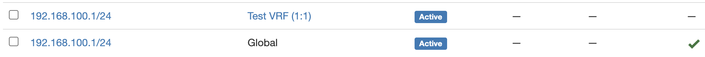
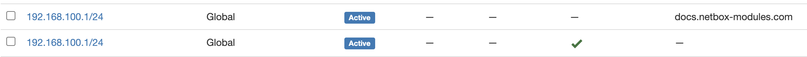

==============================
Advanced Usage - Modules
==============================

Now that we've gotten the basics out of the way. We can dive into a few more of the advanced uses within this collection.

Passing in Dictionaries
-------------------------------

There will be times that you need to specify more information to resolve the ID of an object tied to the main object due to the information not being unique enough to find a single object within NetBox.
A good example of this is specifying ``nat_inside`` when using the :ref:`netbox.netbox.netbox_ip_address<ansible_collections.netbox.netbox.netbox_ip_address_module>` module.

If your NetBox instance is using the default settings then ``ENFORCE_GLOBAL_UNIQUE`` will be set to ``False`` which means that the chances of having a duplicate IP is high and most likely intended.

Let's take a look at specifying just the IP address in CIDR notation and see what results we get.

.. code-block:: yaml

  ---
  ...
    tasks:
      - name: "Add ip address to netbox"
        netbox.netbox.netbox_ip_address:
          netbox_url: "http://netbox.local"
          netbox_token: "thisIsMyToken"
          data:
            address: "192.168.10.60/24"
            vrf: "Test VRF"
            nat_inside: "192.168.100.1/24"
          state: present

.. code-block:: bash

  ❯ ansible-playbook netbox-ip.yml -v
  No config file found; using defaults
  [WARNING]: No inventory was parsed, only implicit localhost is available
  [WARNING]: provided hosts list is empty, only localhost is available. Note that the implicit localhost does not match 'all'

  PLAY [localhost] **********************************************************************************************************************

  TASK [Add ip address to netbox] *******************************************************************************************************
  fatal: [localhost]: FAILED! => {"changed": false, "msg": "More than one result returned for nat_inside"}

We can see from the error we get that we have more than a single result when attempting to resolve ``192.168.100.1/24``.
Let's check NetBox to see what additional information we can provide to grab the correct IP address.

We can see one of the IPs is assigned to the VRF that matches the VRF our new IP should be part of as well. Let's go ahead and build out the dictionary for ``nat_inside``.

.. code-block:: yaml

  ---
  ...
    tasks:
      - name: "Add ip address to netbox"
        netbox.netbox.netbox_ip_address:
          netbox_url: "http://netbox.local"
          netbox_token: "thisIsMyToken"
          data:
            address: "192.168.10.60/24"
            vrf: "Test VRF"
            nat_inside:
              address: "192.168.100.1/24"
              vrf: "Test VRF"
          state: present

Since ``nat_inside`` is an IP address, we will specify the same arguments that we would use to search for the IP address in the API. Let's run the playbook now.

.. code-block:: bash

  ❯ ansible-playbook netbox-ip.yml -v
  No config file found; using defaults
  [WARNING]: No inventory was parsed, only implicit localhost is available
  [WARNING]: provided hosts list is empty, only localhost is available. Note that the implicit localhost does not match 'all'

  PLAY [localhost] **********************************************************************************************************************

  TASK [Add ip address to netbox] *******************************************************************************************************
  changed: [localhost] => {"changed": true, "ip_address": {"address": "192.168.10.60/24", "assigned_object": null, "assigned_object_id": null, "assigned_object_type": null, "created": "2021-01-01", "custom_fields": {}, "description": "", "dns_name": "", "family": 4, "id": 11, "last_updated": "2021-01-01T17:19:18.999051Z", "nat_inside": 10, "nat_outside": null, "role": null, "status": "active", "tags": [], "tenant": null, "url": "http://192.168.50.10:8000/api/ipam/ip-addresses/11/", "vrf": 1}, "msg": "ip_address 192.168.10.60/24 created"}

  PLAY RECAP ****************************************************************************************************************************
  localhost                  : ok=1    changed=1    unreachable=0    failed=0    skipped=0    rescued=0    ignored=0

We can see that the task was successful and ``nat_inside`` resolved to ID ``10``.

Hopefully this helps you understand how you can provide more specific information for objects that need to be resolved before any ``POST/PUT/PATCH`` calls are made to NetBox.

Passing in IDs Manually
-------------------------------

Passing in an ID requires you to know the ID of the object. This probably isn't the most sensible way, but it's definitely possible and may suit certain situations.

Let's take the same example and delete the IP address that was just created and then substitute the dictionary for ``nat_inside`` with ``10``.

.. code-block:: yaml

  ---
  ...
    tasks:
      - name: "Add ip address to netbox"
        netbox.netbox.netbox_ip_address:
          netbox_url: "http://netbox.local"
          netbox_token: "thisIsMyToken"
          data:
            address: "192.168.10.60/24"
            vrf: "Test VRF"
            nat_inside: 10
          state: present

Here are the results and they're identical to the when we specified a dictionary.

.. code-block:: bash

  ❯ ansible-playbook netbox-ip.yml -v
  No config file found; using defaults
  [WARNING]: No inventory was parsed, only implicit localhost is available
  [WARNING]: provided hosts list is empty, only localhost is available. Note that the implicit localhost does not match 'all'

  PLAY [localhost] **********************************************************************************************************************

  TASK [Add ip address to netbox] *******************************************************************************************************
  changed: [localhost] => {"changed": true, "ip_address": {"address": "192.168.10.60/24", "assigned_object": null, "assigned_object_id": null, "assigned_object_type": null, "created": "2021-01-01", "custom_fields": {}, "description": "", "dns_name": "", "family": 4, "id": 12, "last_updated": "2021-01-01T17:28:29.770142Z", "nat_inside": 10, "nat_outside": null, "role": null, "status": "active", "tags": [], "tenant": null, "url": "http://192.168.50.10:8000/api/ipam/ip-addresses/12/", "vrf": 1}, "msg": "ip_address 192.168.10.60/24 created"}

  PLAY RECAP ****************************************************************************************************************************
  localhost                  : ok=1    changed=1    unreachable=0    failed=0    skipped=0    rescued=0    ignored=0

Using nb_lookup Plugin to Provide ID or Object
-----------------------------------------------------

There are two options to use the lookup plugin.

1. Pass in the object obtained by :ref:`nb_lookup<ansible_collections.netbox.netbox.netbox_lookup_lookup>`.
2. Pass in a dictionary with the key being ``id`` and the value of the lookup plugin after filtering to get the ID attribute.

.. note:: The reason for the second option is due to the fact that the lookup plugin uses Jinja and will only cast as a string and not an integer.

Option 1: Lookup Plugin Object
++++++++++++++++++++++++++++++++++

Let's go ahead and look at the first way by just passing in the complete object that it finds.

.. code-block:: yaml

  ---
  ...
  tasks:
    - name: "Add ip address to netbox"
      netbox.netbox.netbox_ip_address:
        netbox_url: "http://netbox.local"
        netbox_token: "thisIsMyToken"
        data:
          address: "192.168.10.60/24"
          vrf: "Test VRF"
          nat_inside: "{{ lookup('netbox.netbox.nb_lookup', 'ip-addresses', api_filter='address=192.168.100.1/24 vrf=1:1', api_endpoint='http://netbox.local', token='thisIsMyToken', validate_certs=False, raw_data=True) }}"
        state: present

.. code-block:: bash

  ❯ ansible-playbook netbox-ip.yml -v
  No config file found; using defaults
  [WARNING]: No inventory was parsed, only implicit localhost is available
  [WARNING]: provided hosts list is empty, only localhost is available. Note that the implicit localhost does not match 'all'

  PLAY [localhost] **********************************************************************************************************************

  TASK [Add ip address to netbox] *******************************************************************************************************
  changed: [localhost] => {"changed": true, "ip_address": {"address": "192.168.10.60/24", "assigned_object": null, "assigned_object_id": null, "assigned_object_type": null, "created": "2021-01-01", "custom_fields": {}, "description": "", "dns_name": "", "family": 4, "id": 12, "last_updated": "2021-01-01T17:28:29.770142Z", "nat_inside": 10, "nat_outside": null, "role": null, "status": "active", "tags": [], "tenant": null, "url": "http://192.168.50.10:8000/api/ipam/ip-addresses/12/", "vrf": 1}, "msg": "ip_address 192.168.10.60/24 created"}

  PLAY RECAP ****************************************************************************************************************************
  localhost                  : ok=1    changed=1    unreachable=0    failed=0    skipped=0    rescued=0    ignored=0

The lookup plugin grabs the object from NetBox, serializes it into a dictionary, and then passes it into the module. This is similar to the :ref:`Passing in Dictionaries`, but allows you to find the information yourself without relying on the internal
resolution methods used in the modules.

Option 2: Lookup Plugin ID
++++++++++++++++++++++++++++++

Let's take a look at option two. We'll delete the IP address from NetBox and then use the following task.

.. code-block:: yaml

  ---
  ...
  tasks:
    - name: "Add ip address to netbox"
      netbox.netbox.netbox_ip_address:
        netbox_url: "http://netbox.local"
        netbox_token: "thisIsMyToken"
        data:
          address: "192.168.10.60/24"
          vrf: "Test VRF"
          nat_inside:
            id: "{{ query('netbox.netbox.nb_lookup', 'ip-addresses', api_filter='address=192.168.100.1/24 vrf=1:1', api_endpoint='http://netbox.local', token='thisIsMyToken', validate_certs=False, raw_data=True) | map(attribute='id') | first }}"
        state: present

There are a few differences between the two options since we use ``query`` rather than ``lookup`` since it returns a list that we can then use the ``map()`` Jinja filter to extract the ID field from the result
and then we capture the first element (there should only be one).

The collection will actually convert the string it receives for the ``id`` and then convert it to an integer.

.. code-block:: bash

  ❯ ansible-playbook netbox-ip.yml -v
  No config file found; using defaults
  [WARNING]: No inventory was parsed, only implicit localhost is available
  [WARNING]: provided hosts list is empty, only localhost is available. Note that the implicit localhost does not match 'all'

  PLAY [localhost] **********************************************************************************************************************

  TASK [Add ip address to netbox] *******************************************************************************************************
  changed: [localhost] => {"changed": true, "ip_address": {"address": "192.168.10.60/24", "assigned_object": null, "assigned_object_id": null, "assigned_object_type": null, "created": "2021-01-01", "custom_fields": {}, "description": "", "dns_name": "", "family": 4, "id": 12, "last_updated": "2021-01-01T17:28:29.770142Z", "nat_inside": 10, "nat_outside": null, "role": null, "status": "active", "tags": [], "tenant": null, "url": "http://192.168.50.10:8000/api/ipam/ip-addresses/12/", "vrf": 1}, "msg": "ip_address 192.168.10.60/24 created"}

  PLAY RECAP ****************************************************************************************************************************
  localhost                  : ok=1    changed=1    unreachable=0    failed=0    skipped=0    rescued=0    ignored=0

Using query_params Module Argument
--------------------------------------------

There will be times when you want to override the builtin **ALLOWED_QUERY_PARAMS** to provide a unique search of an object.

To make this possible, every module accepts the ``query_params`` argument. This argument allows you to specify a list of strings for the module arguments
you want to use to search for the object.

Let's start with another example. We will continue to use :ref:`netbox.netbox.netbox_ip_address<ansible_collections.netbox.netbox.netbox_ip_address_module>`. We created **192.168.100.1/24** as a duplicate IP address within
the global IP address space within NetBox. This task should fail saying there was more than result returned.

.. code-block:: yaml

  ---
  ...
    tasks:
      - name: "Update non-unique IP address"
        netbox.netbox.netbox_ip_address:
          netbox_url: "http://netbox.local"
          netbox_token: "thisIsMyToken"
          data:
            address: "192.168.100.1/24"

.. code-block:: bash

  ❯ ansible-playbook netbox-ip.yml -v
  No config file found; using defaults
  [WARNING]: No inventory was parsed, only implicit localhost is available
  [WARNING]: provided hosts list is empty, only localhost is available. Note that the implicit localhost does not match 'all'

  PLAY [localhost] ****************************************************************************************************************************************************************************************************************

  TASK [Update non-unique IP address] *********************************************************************************************************************************************************************************************
  [WARNING]: Skipping plugin (/Users/myohman/Documents/local-dev/ansible/filter_plugins/my_filter_plugin.py) as it seems to be invalid: expected an indented block (my_filter_plugin.py, line 19)
  fatal: [localhost]: FAILED! => {"changed": false, "msg": "More than one result returned for 192.168.100.1/24"}

  PLAY RECAP **********************************************************************************************************************************************************************************************************************
  localhost                  : ok=0    changed=0    unreachable=0    failed=1    skipped=0    rescued=0    ignored=0

We get our desired result. Let's take a look at our IP addresses and see what field we can use to make a unique search for the duplicate IP addresses.

We can see that ``dns_name`` will make a unique search. Now let's go ahead and specify our custom ``query_params`` to search for both the ``address`` and ``dns_name`` and then update the
IP address to be within **Test VRF 2**.

.. code-block:: yaml

  ---
  ...
    tasks:
      - name: "Update non-unique IP address"
        netbox.netbox.netbox_ip_address:
          netbox_url: "http://netbox.local"
          netbox_token: "thisIsMyToken"
          data:
            address: "192.168.100.1/24"
            dns_name: "docs.netbox-modules.com"
            vrf: "Test VRF 2"
          query_params:
            - address
            - dns_name

.. code-block:: bash

  ❯ ansible-playbook netbox-ip.yml -v
  No config file found; using defaults
  [WARNING]: No inventory was parsed, only implicit localhost is available
  [WARNING]: provided hosts list is empty, only localhost is available. Note that the implicit localhost does not match 'all'

  PLAY [localhost] **********************************************************************************************************************

  TASK [Update non-unique IP address] ***************************************************************************************************
  changed: [localhost] => {"changed": true, "ip_address": {"address": "192.168.100.1/24", "assigned_object": null, "assigned_object_id": null, "assigned_object_type": null, "created": "2021-01-01", "custom_fields": {}, "description": "", "dns_name": "docs.netbox-modules.com", "family": 4, "id": 15, "last_updated": "2021-01-01T19:16:49.756265Z", "nat_inside": null, "nat_outside": null, "role": null, "status": "active", "tags": [], "tenant": null, "url": "http://192.168.50.10:8000/api/ipam/ip-addresses/15/", "vrf": 2}, "msg": "ip_address 192.168.100.1/24 updated"}

  PLAY RECAP ****************************************************************************************************************************
  localhost                  : ok=1    changed=1    unreachable=0    failed=0    skipped=0    rescued=0    ignored=0

We can now see that the IP address is now within VRF with ID 2.

Hopefully this shines some light on this useful feature to allow you, as the user, to define your specific needs for finding a unique object within your NetBox instance.

Using Module defaults groups
--------------------------------------------

Ansible-core >= 2.12 provide a useful feature called [Module defaults groups](https://docs.ansible.com/ansible/latest/user_guide/playbooks_module_defaults.html#module-defaults-groups) that lets us specify default parameters for a group of modules in a single place. We can use the action_group ``netbox`` that contains all modules from this collection to avoid setting e.g. ``token`` and ``url`` on each task and thus reduce boilerplate code.

.. code-block:: yaml

   ---
   - hosts: "localhost"

     module_defaults:
       group/netbox.netbox.netbox:
         netbox_url: "http://netbox.local"
         netbox_token: "thisIsMyToken"

     tasks:
       - name: "Create device type"
         netbox.netbox.netbox_device_type:
           data:
             model: "test-device-type"
             slug: "c9410r"

       - name: "Create device"
         netbox.netbox.netbox_device:
           data:
             name: "Test Device"
             device_type: "C9410R"
             device_role: "Core Switch"
             site: "Main"

