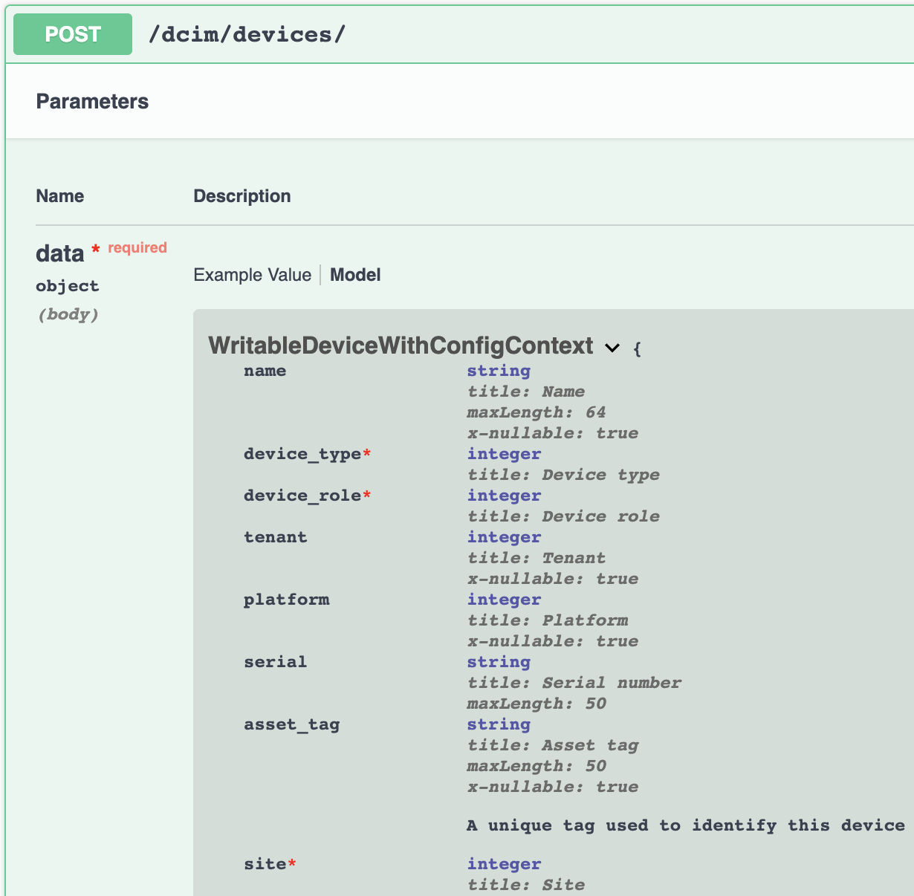

Modules
===============

Specifying Modules in a Playbook
----------------------------------

There are two methods when using a collection in a playbook (in preferred order):

1. Using the Fully Qualified Collection Name (FQCN) of the module, e.g. ``netbox.netbox.netbox_device`` at the task level.
2. Using the ``collections`` directive at the play level.

.. code-block:: yaml

  ---
  - hosts: "localhost"

    tasks:
      - name: "Configure a device in NetBox"
        netbox.netbox.netbox_device:
        <.. omitted>

.. code-block:: yaml

  ---
  - hosts: "localhost"
    collections:
      - netbox.netbox

    tasks:
      - name: "Configure a device in NetBox"
        netbox_device:
        <.. omitted>

To validate that the playbook is using the collection modules and not the Ansible builtin modules, add ``-vvv`` and look for the following line within the output for each task executed.

.. code-block:: bash

   Using module file /Users/netbox/.ansible/collections/ansible_collections/netbox/netbox/plugins/modules/netbox_device.py

You can find more information at the official Ansible docs_.

.. _docs: https://docs.ansible.com/ansible/latest/user_guide/collections_using.html#installing-collections

.. note:: If you are on MacOS and are running into ``ERROR! A worker was found in a dead state errors``, try running the playbook with ``env no_proxy='*'`` tag in front of the playbook. This is a known issue with MacOS as per this reference: https://github.com/ansible/ansible/issues/32554#issuecomment-642896861

Module Arguments & States
----------------------------

This section will provide details on why some module arguments are required for certain states or even change if an object already exists.

Before we go any further, let's provide some preliminary knowledge of how Ansible works when accepting arguments into a module.

Ansible provides several builtin methods when initializing the ``AnsibleModule`` to help build flexible module argument requirements. We aren't going to explore all the options in depth, but there are three that we currently use within this collection.

- **argument_spec**: Defines a schema for acceptable arguments for a module along with their type, and specifying whether an argument is required or not.
- **required_if**: Allows logic to define that an argument is required if another argument and it's value meets the specified condition.
- **required_one_of**: Specifies logic that at least one of the arguments specified is required.

Most modules will require the minimal amount of arguments to find a unique object in NetBox via the **argument_spec** that gets passed into ``AnsibleModule``.

.. _Module Development: https://docs.ansible.com/ansible/latest/dev_guide/developing_program_flow_modules.html#ansiblemodule
.. note:: For more information, please view Ansible's documentation for Module Development_.

This does mean that the modules may make the call to NetBox to create an object and the API will reply back advising the user that required fields were missing for the specific operation and causes the module to fail.

.. code-block:: bash

  failed: [localhost] (item={'unit': 2, 'type': 'nexus-child'}) => {"ansible_loop_var": "item", "changed": false, "item": {"type": "nexus-child", "unit": 2}, "msg": "{\"device_role\":[\"This field is required.\"]}"}

To expand further, our ``present`` state can either **create** or **update** an object. If the object does not exist within NetBox it will send a ``POST`` and create the object.
If the object already exists, the fetched object from NetBox is captured with ``pynetbox`` and will already have the required fields, which means the user only needs to provide the updated fields.
The next step is to then compare the object obtained from NetBox to the data passed in by the user into the module and only update the fields that are different. This is all handled behind the scenes within the modules.

Hopefully this helps paint a picture as to why certain design decisions were made and how you can better consume this collection. Let's move onto some examples.

State: Present - Create
+++++++++++++++++++++++++++++

When creating an object, you will need to provide the same arguments as you would if you were creating an object via the API.

Let's take a look at creating a device via the API.

The required fields are marked by ``*`` and we can see the following are fields are required:

  - **device_type**
  - **device_role**
  - **site**

These same fields are required when creating a device via the :ref:`netbox_device <ansible_collections.netbox.netbox.netbox_device_module>` module, but with the important addition of **name**.

.. code-block:: yaml

  ---
  ...
    tasks:
      - name: "Example for state: present"
        netbox.netbox.netbox_device:
          netbox_url: "http://netbox.local"
          netbox_token: "thisIsMyToken"
          data:
            name: "Test Device"
            device_type: "C9410R"
            device_role: "Core Switch"
            site: "Main"
          state: present

The reasoning behind requiring **name** within the Ansible modules is to provide the module with the ability to distinguish between devices or objects within NetBox. The name helps make the device unique rather than attempting to only
search on ``device_type``, ``device_role``, and ``site`` as these do not make a device unique and makes it difficult to assume which device the user cares about.
These modules are abstracting away the API interaction and some of the logic which means we require the users to provide a bit more information as to what they're intending to do. We're trying to keep the abstractions to a minimum,
but that isn't always possible.

Along with forcing a user to provide some uniqueness to their objects in NetBox, we also try and mirror the module interaction with the GUI interaction where we can to prevent burdening the user.
For instance, the ``slug`` field is required when interacting with the API for the majority of models in NetBox, but constructing the ``slug`` is handled for the user within the GUI. To stay aligned with the GUI,
we abstract that away from the user by constructing the ``slug`` from the ``name`` using the same rules as the NetBox GUI.

For reference, here is the code that **slugifies** the ``name`` argument when a user does not provide a ``slug``.

.. code-block:: python

    def _to_slug(self, value):
        """
        :returns slug (str): Slugified value
        :params value (str): Value that needs to be changed to slug format
        """
        if value is None:
            return value
        elif isinstance(value, int):
            return value
        else:
            removed_chars = re.sub(r"[^\-\.\w\s]", "", value)
            convert_chars = re.sub(r"[\-\.\s]+", "-", removed_chars)
            return convert_chars.strip().lower()

Now that we have a better understanding of why certain arguments are required or not, let's look into updating an existing object.

State: Present - Update
+++++++++++++++++++++++++++++

Now that we have created our device (**Test Device**), let's update it by adding a serial number.

.. code-block:: yaml

  ---
  ...
    tasks:
      - name: "Example state: present - Update"
        netbox.netbox.netbox_device:
          netbox_url: "http://netbox.local"
          netbox_token: "thisIsMyToken"
          data:
            name: "Test Device"
            serial: "FXS110011"
          state: "present"

We're only providing the **name** which makes the device unique and then the argument we want updated. As stated above, it will see that the device exist, and then update the ``serial`` field and then send a
``PATCH`` to the NetBox API.

.. note::
  You can add the ``query_params`` argument to specify specific fields that make the object unique in your environment.

  Defining ``query_params`` overrides the default fields the modules use when attempting to resolve the object.

  More information can be found in the :ref:`Advanced Usage` section.

State: Absent - Delete
+++++++++++++++++++++++++++++

The uniqueness of the device (**name** or user specified **query_params**) and the ``state`` set to ``absent`` are the only requirements for deleting an object.

.. code-block:: yaml

  ---
  ...
    tasks:
      - name: "Example state: absent"
        netbox.netbox.netbox_device:
          netbox_url: "http://netbox.local"
          netbox_token: "thisIsMyToken"
          data:
            name: "Test Device"
          state: "absent"

Tags
+++++++++++++++

Not all models support tags, but several of them do so I wanted to talk a little bit more about them outside of a module context since they're
applied the same irregardless of which module you're using.

.. note::
  Tags changed significantly starting NetBox 2.10.

  We will not be covering pre-2.10 tags within these docs.

Tags are now a model within NetBox and require being resolved like any other model such as ``device_type`` shown above. This requires the user to provide a list of dictionaries
that specify fields that are unique to each tag. Name can be used, but we always suggest that you use ``slug`` when available.

.. code-block:: yaml

  ---
  ...
    tasks:
      - name: "Example using tags"
        netbox.netbox.netbox_device:
          netbox_url: "http://netbox.local"
          netbox_token: "thisIsMyToken"
          data:
            name: "Test Device"
            tags:
              - slug: "my-new-tag1"
              - slug: "my-new-tag2"
          state: "present"

.. warning:: Everything discussed above can be applied to each module, but may need to swap out any arguments for module specific arguments.

Using module default groups
+++++++++++++++++++++++++++++

To avoid having to define the ``netbox_url`` and ``netbox_token`` in each task you can use the module default group feature.

.. code-block:: yaml

  ---
  ...
    module_defaults:
      group/netbox.netbox.netbox:
        netbox_url: "http://netbox.local"
        netbox_token: "thisIsMyToken"
    tasks:
      - name: "Example using tags"
        netbox.netbox.netbox_device:
          data:
            name: "Test Device"
            tags:
              - slug: "my-new-tag1"
              - slug: "my-new-tag2"
          state: "present"

      - name: "Example state: present - Update"
        netbox.netbox.netbox_device:
          data:
            name: "Test Device"
            serial: "FXS110011"
          state: "present"

.. note::
  Module default groups are available from Ansible 2.12.